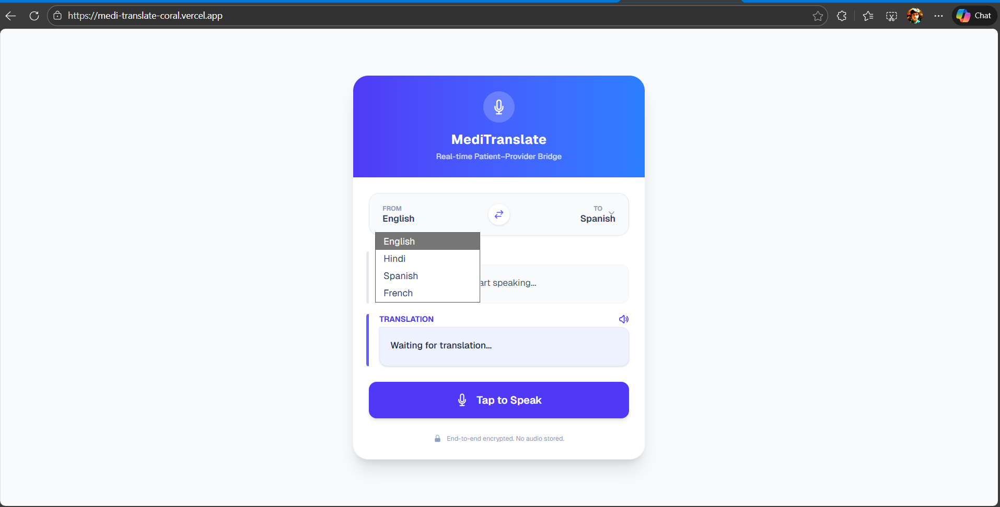
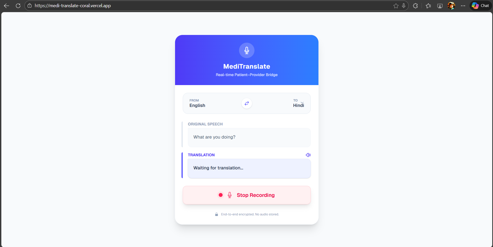
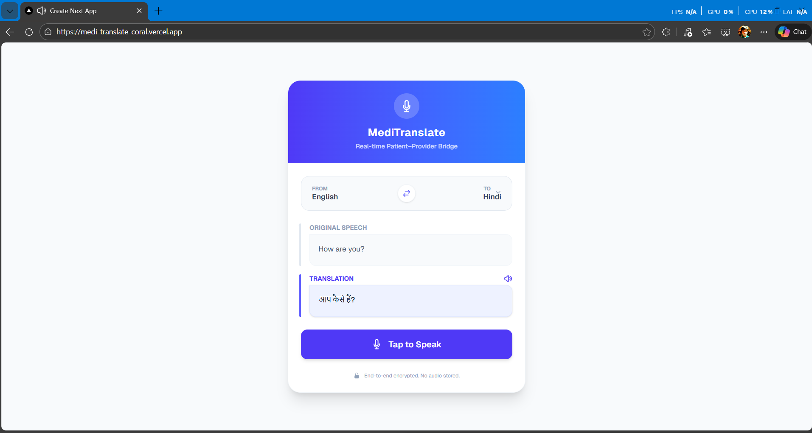

# 🏥 MediTranslate – Healthcare Translation Web App

🔗 **Live Demo:** [https://medi-translate-coral.vercel.app/](https://medi-translate-coral.vercel.app/)

📦 **GitHub Repository:** [https://github.com/Chitravansh/MediTranslate](https://github.com/Chitravansh/MediTranslate)

---

## 📌 Overview

**MediTranslate** is a mobile-first, AI-powered healthcare translation web application designed to enable real-time multilingual communication between patients and healthcare providers. The app converts spoken input into text, translates it into a selected target language, and provides audio playback of the translated output — all while prioritizing privacy and simplicity.

This project was developed as part of a **pre-interview technical assignment** to demonstrate rapid prototyping, effective use of generative AI, and thoughtful UX design in a healthcare context.

---

## ✨ Key Features

* 🎤 **Voice-to-Text (Speech Recognition)**
  Uses the browser’s Web Speech API to convert spoken input into text, with support for multiple input languages.

* 🌍 **AI-Powered Medical Translation**
  Leverages **OpenRouter (OpenAI-compatible models)** to translate medical conversations accurately while preserving context and terminology.

* 🔊 **Text-to-Speech Playback**
  Enables audio playback of translated text in the selected target language using browser-native speech synthesis.

* 🔁 **Language Swap (From ↔ To)**
  One-tap swap between source and target languages for quick role reversal between patient and provider.

* 📱 **Mobile-First, Responsive UI**
  Clean and intuitive interface optimized for both mobile and desktop devices.

* 🔐 **Privacy-First Design**
  No audio or transcripts are stored. All processing is done in-session with no persistent data retention.

---

## 🛠️ Tech Stack

* **Frontend:** Next.js (App Router), React, TypeScript
* **Styling:** Tailwind CSS
* **Speech Recognition:** Web Speech API
* **Text-to-Speech:** Browser Speech Synthesis API
* **AI Translation:** OpenRouter (OpenAI-compatible SDK)
* **Deployment:** Vercel

---

## ⚙️ How It Works

1. User selects **input (From)** and **output (To)** languages.
2. User taps the **Tap to Speak** button and speaks.
3. Speech is transcribed in real time using the browser’s speech recognition.
4. On stopping the recording, the transcript is sent to the AI translation API.
5. The translated text is displayed and can be played back using the **Speak** button.
6. Languages can be swapped instantly using the swap icon.

---

## 🔐 Data Privacy & Security

* No audio recordings are saved or transmitted.
* No transcripts are stored on the server.
* API keys are managed securely using environment variables.
* HTTPS enforced by default via Vercel deployment.

This makes the prototype suitable for healthcare environments where confidentiality is critical.

---

## 🖼️ Screenshots


```text
📸 Screenshot 1: Home screen with language selection
```

```text
📸 Screenshot 2: Live speech-to-text transcription
```

```text
📸 Screenshot 3: Translated output with audio playback
```



---

## 🚀 Running Locally

```bash
# Clone the repository
git clone https://github.com/Chitravansh/MediTranslate.git
cd MediTranslate

# Install dependencies
npm install

# Create environment file
# .env.local
OPENAI_API_KEY=your_openrouter_api_key

# Run the development server
npm run dev
```

Open [http://localhost:3000](http://localhost:3000) to view the app in your browser.

---

## 📦 Deployment

The app is deployed on **Vercel**:

👉 [https://medi-translate-coral.vercel.app/](https://medi-translate-coral.vercel.app/)

Environment variables are configured securely in the Vercel dashboard.

---

## 🧪 Limitations & Future Improvements

* Real-time word-by-word translation could be added for continuous conversations.
* Manual text input mode for accessibility (optional enhancement).
* Support for additional languages and dialects.
* Role-based UI for patient vs provider.

---

## 🧠 Use of Generative AI

Generative AI was used for:

* Medical-context-aware translation using LLMs.
* Rapid prototyping and iteration during development.

AI-assisted development enabled faster delivery while maintaining code clarity and correctness.

---

## 👤 Author

**Chitravansh Mohan**
GitHub: [https://github.com/Chitravansh](https://github.com/Chitravansh)

---

## 📄 License

This project is intended for educational and evaluation purposes as part of a technical interview assignment.
